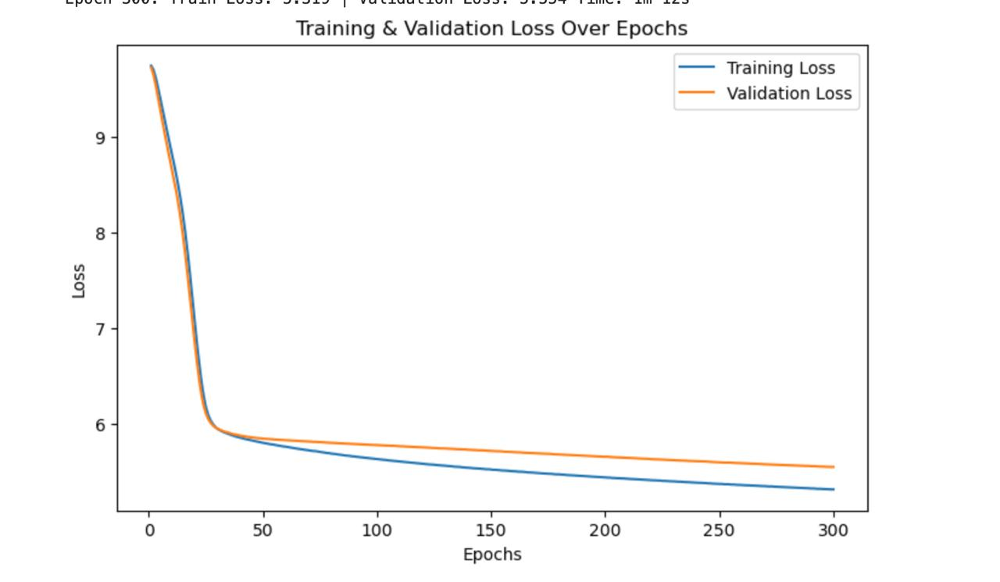

# Transformer Implementation from scratch

## Overview
This project implements a Transformer-based neural machine translation model to translate English sentences into German. The architecture is written from sratch following 'Attention is all you need' [paper](https://arxiv.org/abs/1706.03762). The model is trained using the Multi30k dataset and employs PyTorch for deep learning computations. The training process is relatively slow due to limited computational resources, and the test outputs are not yet optimal.

## Project Structure
The project is divided into multiple Python files, each serving a specific purpose. Below is a detailed explanation of each file and its role in the project:

### 1. `model.py`
This file defines the Transformer model architecture, including the encoder and decoder components. The main components include:

- **SelfAttention**: Implements multi-head self-attention to capture dependencies between words in a sequence.
- **TransformerBlock**: Applies self-attention followed by a feedforward network.
- **Encoder**: Consists of multiple TransformerBlocks and processes the source text.
- **Decoder**: Includes masked self-attention and cross-attention layers to generate the target text.
- **Transformer**: The main model that combines the encoder and decoder to perform translation.

#### Example Usage:
```python
from model import Transformer
model = Transformer(src_vocab_size, trg_vocab_size, src_pad_idx, trg_pad_idx).to(device)
```

### 2. `dataset.py`
This file handles data loading, tokenization, and vocabulary creation. It uses **TorchText** to preprocess the Multi30k dataset.

- **Tokenization**: Uses SpaCy tokenizers for English and German.
- **Vocabulary Building**: Converts words into numerical indices using a vocabulary dictionary.
- **Data Preprocessing**:
  - Text is tokenized and numericalized.
  - Special tokens `<bos>` and `<eos>` are added to mark sentence boundaries.
  - Sequences are padded to the longest length in a batch.

#### Example Data Transformation:
```python
from dataset import en_tokenizer, de_tokenizer
text = "This is a sample sentence."
tokens = en_tokenizer(text)
print(tokens)  # ['This', 'is', 'a', 'sample', 'sentence', '.']
```

### 3. `train.py`
This file contains the training and evaluation functions. It defines the:

- **train()**: Loops over batches, computes loss, and updates model weights.
- **evaluate()**: Computes validation loss to monitor model performance.
- **InverseSqrtLR**: Implements a learning rate scheduler based on inverse square root decay.

#### Training Changes from Original Paper:
- **Gradient Clipping**: We apply clipping (`max_norm=5`) to prevent exploding gradients.
- **Inverse Square Root Scheduler**: Adjusts the learning rate dynamically based on training steps.

#### Example Training Loop:
```python
train_loss = train(model, train_dataloader, optimizer, scheduler, loss_fn, device, clip)
```

### 4. `inference.py`
Handles translation of new sentences and computing BLEU scores.

- **load_model()**: Loads a trained model from a checkpoint.
- **translate_sentence()**: Translates an input sentence using the trained model.
- **compute_bleu()**: Computes the BLEU score to measure translation quality.

#### Example Translation:
```python
from inference import translate_sentence
sentence = "A man is playing guitar."
translated = translate_sentence(model, sentence, en_vocab, de_vocab, en_tokenizer, device)
print(translated)
```

### 5. `run.py`
This is the main script to execute training and evaluation. It performs:

- **Data Loading**: Loads and splits the dataset into training, validation, and test sets.
- **Model Initialization**: Defines the Transformer model and optimizer.
- **Training Execution**: Calls `train.py` functions to run training.
- **Testing**: Evaluates the model and prints test results.

#### Running the Script:
```bash
python run.py
```

## Dependencies
To run this project, ensure you have the following installed:
```bash
pip install torch torchtext matplotlib sacrebleu spacy
tokenizers
python -m spacy download en_core_web_sm
python -m spacy download de_core_news_sm
```

## Dataset
The **Multi30k** dataset consists of parallel English-German sentence pairs. It is tokenized using SpaCy and converted into numerical representations for model training. Each sentence undergoes the following processing steps:

1. **Tokenization**: Sentence is split into tokens using SpaCy.
2. **Vocabulary Mapping**: Tokens are converted to indices using a vocabulary dictionary.
3. **Adding Special Tokens**: `<bos>` (beginning of sentence) and `<eos>` (end of sentence) are appended.
4. **Padding**: Sentences are padded to the longest sequence in a batch for efficient training.

## Model Architecture
The Transformer model follows the standard architecture introduced in *Attention Is All You Need* but with the following modifications:
- **Pre-Layer Normalization (Pre-LN)** instead of Post-LN for better stability.
- **Learnable Positional Embeddings** instead of fixed sinusoidal embeddings.
- **Inverse Square Root Learning Rate Scheduler** to dynamically adjust learning rate.

## Training Details
Training parameters:
- **Batch Size**: 128
- **Embedding Size**: 512
- **Number of Layers**: 6
- **Number of Heads**: 8
- **Dropout**: 0.1
- **Gradient Clipping**: 5
- **Learning Rate**: 0.001
- **Scheduler**: Inverse Square Root Learning Rate

To start training:
```bash
python run.py
```

## Results
Due to computational limitations, training progresses slowly, and translations are not yet fully accurate. Below is the loss plot over epochs:



BLEU score indicates the model's translation quality:
- **Input:** "A man is playing guitar."
- **Generated:** "Ein Mann spielt Gitarre."
- **Expected:** "Ein Mann spielt die Gitarre."

## Future Improvements
- Train for more epochs for better convergence.
- Adjust hyperparameters like batch size and learning rate.
- Use beam search instead of greedy decoding.

## Acknowledgments
- *Attention Is All You Need* (Vaswani et al., 2017)
- Pytorch Transformers from Scratch (Attention is all you need) by [Aladdin Persson](https://www.youtube.com/watch?v=U0s0f995w14)
- https://github.com/hyunwoongko/transformer
- Transformers from scratch [Blog](https://peterbloem.nl/blog/transformers)

